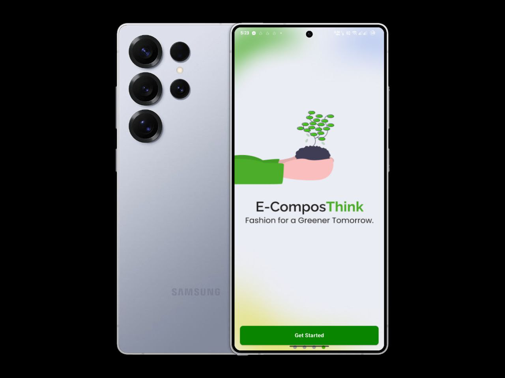
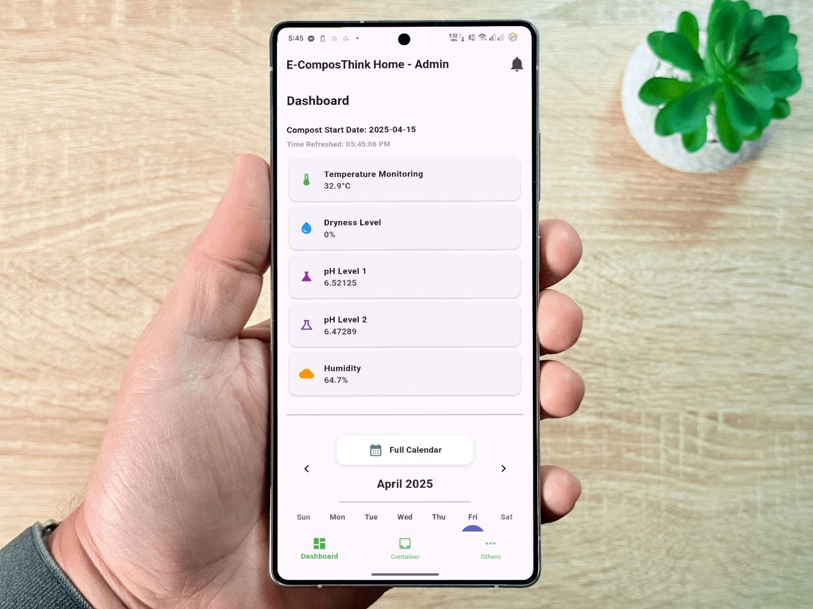
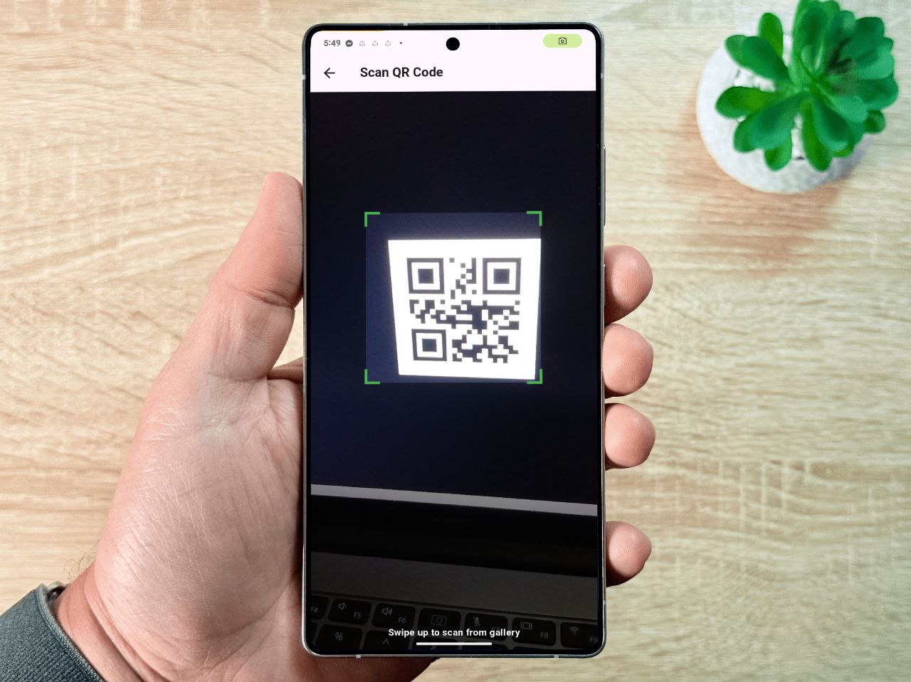
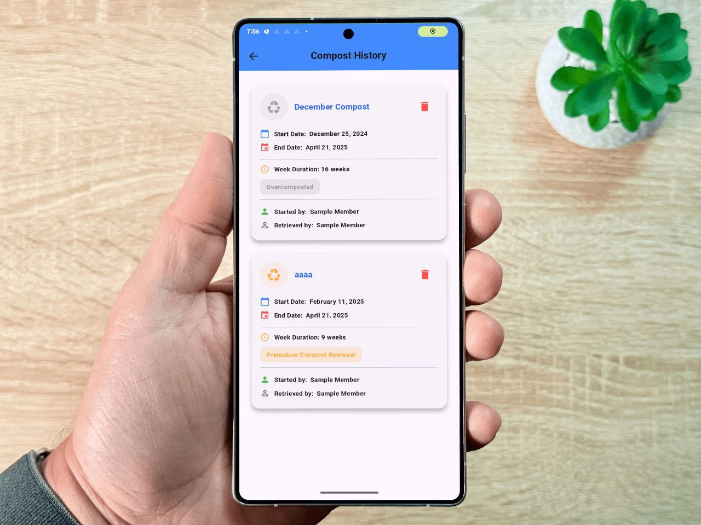
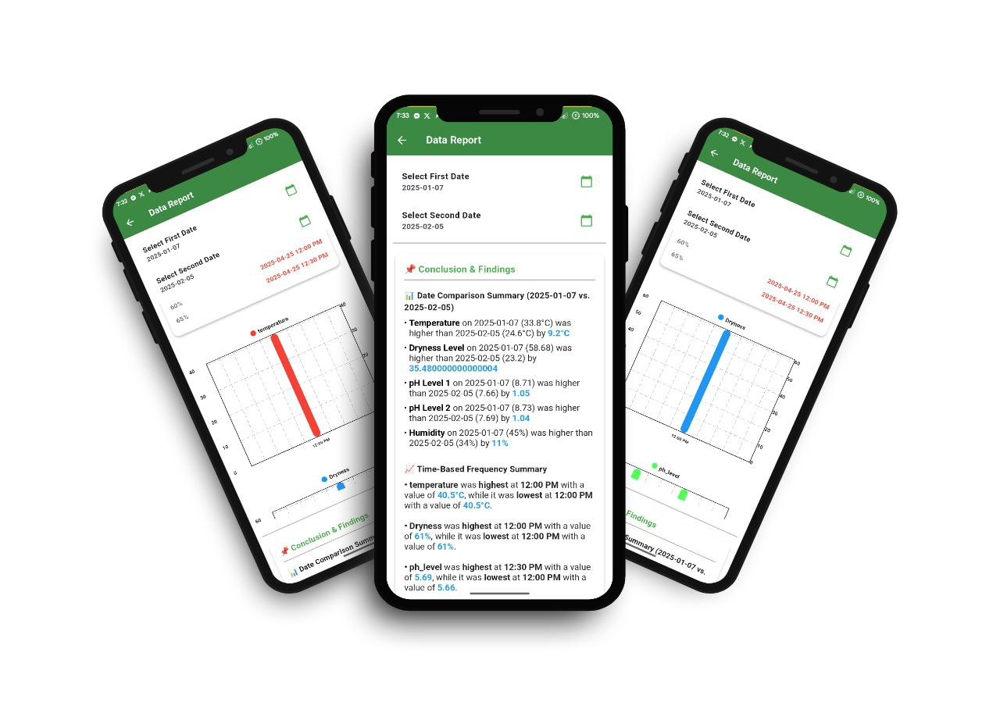
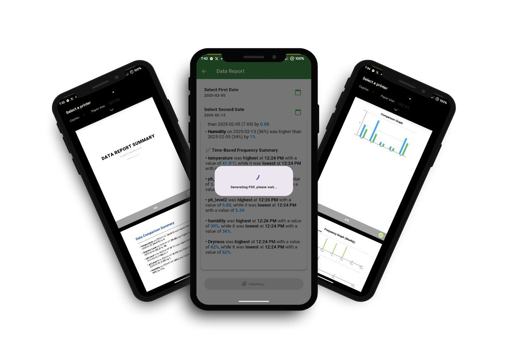

# **Capstone Project of SBIT-4B Group 2 (QCU) E-ComposThink Application**

Welcome to the repository for the capstone project of **SBIT-4B Group 2** at Quezon City University (QCU). This project showcases our innovative solution for urban farming and sustainable waste management.

---

## **Project Overview**
This repository is part of our project titled:  
**E-ComposThink: Smart IoT Organic Food Waste Conversion for Sustainable Urban Farming Monitoring Application with QR Code**.  

Our system integrates IoT technology to monitor composting parameters in real-time, such as temperature, moisture, and pH levels, promoting efficient organic waste conversion for urban farming.

---

## **Repository Structure**
The following folders/files are critical for synchronization. Please ensure they are synced properly:  

- **`lib/`**: Contains the main source code for the Flutter application.  
- **`pubspec.yaml`**: Manages dependencies and configuration for the Flutter app.
- **`assets/`**: Pictures, screenshots, etc.

> **Note:** Other folders are excluded using `.gitignore`.

---

## **Screenshots / Photos**
A glimpse of the E-ComposThink application in action:

<div align="center">

| | | |
|:---:|:---:|:---:|
|  <br> **Sample 1** |  <br> **Sample 2** |  <br> **Sample 3** |
|  <br> **Sample 4** |   <br> **Sample 5** |  <br> **Sample 6** |

</div>

<!-- T 📷 **Tip:** Save your screenshots inside the `assets/screenshots/` folder and update the filenames here accordingly. -->

---

## **E-ComposThink Guide**
[E-ComposThink PDF Guide](https://github.com/BrianAnt0n/E-ComposThink-PDF-Guide/)

---

## **ESP Connection Application**  
To connect to the ESP module, please refer to our dedicated ESP Connection application:  
[ESP Connection App Repository](https://github.com/BrianAnt0n/ESP-CONNECTION-APP)

---

## **Getting Started**
1. Clone this repository.  
   ```bash
   git clone https://github.com/your-repo-link.git
